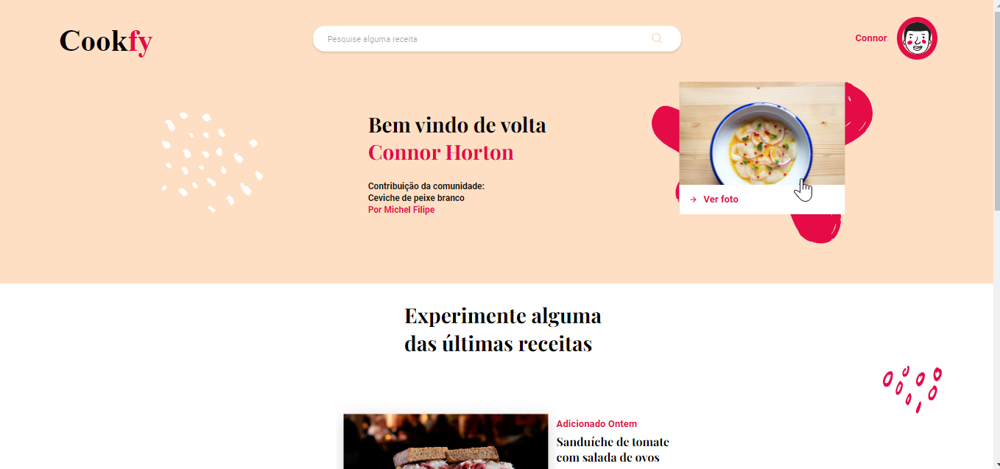

# Cookfy

This is a solution to the [Celero](https://celero.com.br/) challenge - Web Developer.  

## Table of contents

  - [Screenshot](#screenshot)
  - [Links](#links)
  - [Built with](#built-with)
  - [Author](#author)

### Screenshot

### Links

- Solution URL: (https://github.com/fabifelicia/cookfy)
- Live Site URL: (https://cookfy.vercel.app/)

### Built with

- Semantic HTML5 markup
- CSS custom properties
- Flexbox
- JavaScript
- [API](https://randomuser.me/)

## Author

- Fabiana Barreto - [@fabifelicia](https://github.com/fabifelicia)

